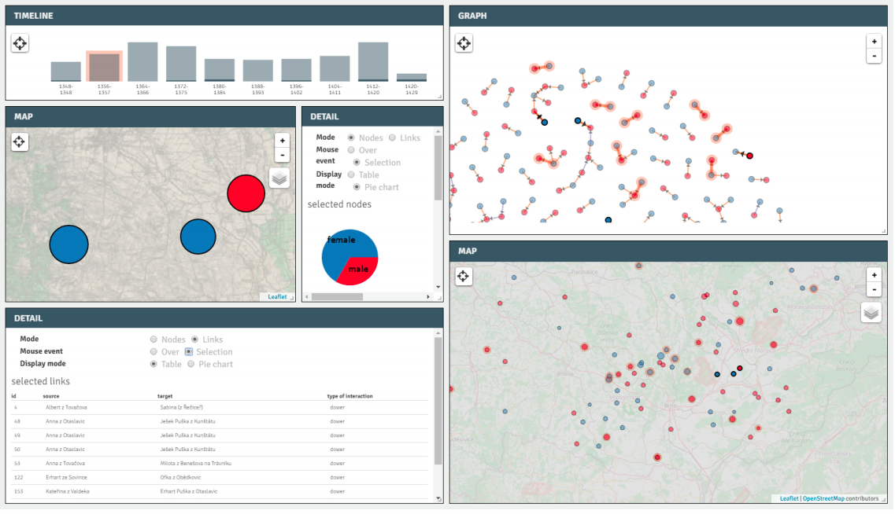

# Historical Data Exploration Tool

#### About

**Authors**:
 - Adam Mertel (Department of Geography, Masaryk University, Brno) - coding
 - Ján Škvrňák (Department of History, Masaryk University, Brno) - data

An experimental application, it's purpose is to present the idea of **linking forms of display for exploratory analysis of historical data**, presented at the [dh2016 conference](http://dh2016.adho.org/), in the form of [poster](https://www.academia.edu/26925717/Linking_Graph_with_Map_for_the_Purpose_of_Historical_Research._Analysis_of_Moravian_Dowries_1348-1420_Case_Study).

---
#### Motivation
It is not possible to fully explore spatiotemporal data with a historical context only within one form of the display - for example, in a map we can see spatial patterns, in the graph, it is possible to study relations. Still, there is not a visualization method that could display the broader context of the whole dataset.  

---
#### Basic idea
In the theory of data exploration, there are various **techniques** that are successfully tested and are proved to be very useful for the process of data exploration:
 - linking forms
 - filtering/brushing
 - grouping, sorting
 - highlighting
 - ..

The application prototype has implemented three **states of data**:
 - default-state
 - over-state - mouse is over particular element in map/graph/timeline
 - selected-state - brushed subset of data

Each group's presence of a particular element could be recognized by defined rules of graphical variables (linking, highlighting implementation). The possibility of creating selected subsets is an implemented brushing theory (user can make selection rectangle on map/graph/table).

There are a number of **forms of display** that could be useful to explore historical data:
 - map
 - graph
 - timeline
 - table
 - various charts (line chart, pie chart, parallel coordinates, ...)
 - statistical outputs
 - ...

All these forms have to be customizable, replicable, and mainly sufficiently linked.

There are still a lot of features that should be implemented in the future:
 - better data management
 - user-defined styling
 - management of selected elements
 - possibility to import own data
 - new forms of display
 - ...

#### Test data - Case Study of Moravian dowries in (1348 - 1420)
Dowries and dowers of high nobility in  Moravia before the Hussite revolution  (15th c.) are a good example of a historical dataset that combines persons, time, and place, while individuals and the places may have more connections among themselves. Time range depends on the state of sources - Charters for the 13th and 14th centuries are preserved only very fragmentary. The qualitative change brought the year of 1348 when Land tables (and real estate registry) were reformed. Suddenly, we can explore the world of minor trades and speculations of the high and lower nobility that had been selling fields and parts of villages (courts, mills, taverns, and ponds).
Some of the entries are related to a controversial property or unlawful occupancy of villages or their parts, which shows us how uncertain the property law was. However, accusations about bandit behavior (siege of castles and strongholds, conquering villages, robbery, and capturing of subjects) are very rare. The number of these social links compared to the previous era grew exponentially. On the other hand, the Hussite revolution is a milestone in the research of social, economic, and cultural relations.

---

#### Similar projects
There are other ongoing projects that are years ahead. We want to mention some of them:
 - [nodegoat](https://nodegoat.net/)
 - [openAtlas](http://www.openatlas.eu/website/)
